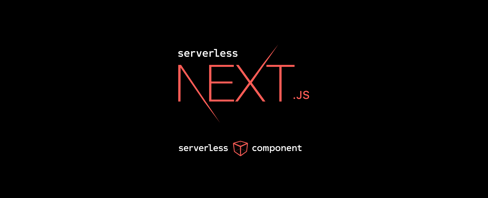
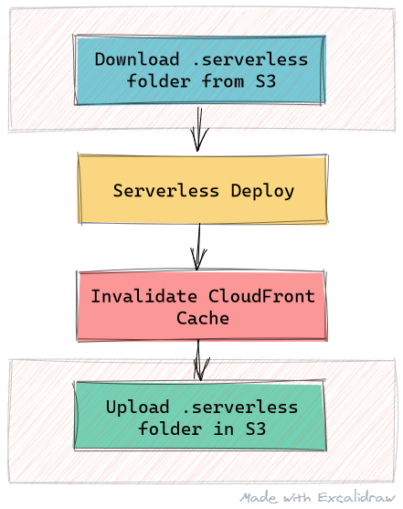

## Intro

Queríamos usar [NextJS](https://nextjs.org/) para una aplicación, y para ello, sentíamos la necesidad de poder deployearla fácilmente en AWS. Después de investigar un poco, llegamos a [Serverless NextJS Component](https://serverless.com/blog/serverless-nextjs/) por [Daniel Conde](https://twitter.com/dcondemarin). Como el nombre dice, components son una nueva manera de construir aplicaciones Serverless. Básicamente el concepto es el mismo que un componente de React, construir y compartir partes utilizables de serverless (como S3, APIGateways, etc).

Al comienzo, estaba **TOTALMENTE** impresionado. Asi es como se veía nuestro `serverless.yml`:

```yml
# serverless.yml

myApp:

 component: serverless-next.js
```

WOW. O sea. WOW. Eso es ultra simple, y amamos las cosas simples. Si ejecutamos `serverless`, deployeará todo lo que necesitamos a AWS, incluyendo:

- S3 Bucket: para los assets y el build de la aplicación.
- Lambdas: para hacer nuestro trabajo de server side rendering.
- CloudFront: para usar nuestras lambdas anteriores y darnos una url para acceder al sitio.

De todas maneras, nos dimos cuenta que habia un issue con esto. Cada vez que ejecutábamos `serverless`, terminaba creando recursos nuevos en AWS. ¿Cómo podríamos resolver esto? 

Muy simple, sin dudas. Vamos a nombrar nuestros recursos, usando el parámetro `inputs` en nuestro `component`.

```yml
# serverless.yml

nextApp:
  component: serverless-next.js
  inputs:
    bucketName: my-name-of-choice-deployment-bucket
    name: my-name-of-choice-default-lambda
```

Okay, ¿qué hemos hecho? Hasta ahora, hemos nombrado nuestro deployment bucket, nuestras lambdas y... Esperen, ¿dónde esta nuestra distribución de CloudFront? 

Tristemente, ahora mismo no hay manera de reutilizar la distribución de CloudFront creada previamente. Esto **no** es un issue del componente de NextJS Serverless; es un issue del componete de CloudFront, y está aclarado en el [repo de NextJS Component](https://github.com/danielcondemarin/serverless-next.js/tree/master/packages/serverless-nextjs-component#cicd-a-new-cloudfront-distribution-is-created-on-every-ci-build-i-wasnt-expecting-that):

    [CI/CD] A new CloudFront distribution is created 
    on every CI build. I wasn't expecting that:
   
    You need to commit your application state in source control. 
    That is the files under the .serverless directory. 
    The serverless team is currently working on remote state 
    storage so this won't be necessary in the future.

No podemos simplemente commitear el estado de nuestra aplicación en nuestro source control. Al menos, esa no era una opción para nosotros. Entonces, ¿cómo podríamos resolver esto?

## Workaround

Como hemos configurado Github Actions para deployear nuestra aplicación, nos hemos dado cuenta que podríamos subir la carpeta `.serverless` al deployment bucket en S3. Nuestro _nuevo_ pipeline se vería de la siguiente manera:



Vamos en detalle paso por paso, e incluso aunque no estuviéses usando Github Actions, podrías hacer lo mismo para el pipeline que estés usando.

NOTA: Tendrás que instalar AWS CLI. Si estás usando Github Actions como nosotros, podes usar [aws-actions](https://github.com/aws-actions/configure-aws-credentials).

### Downloading .serverless folder from S3

Nuestra carpeta `.serverless` contiene un archivo json llamado `Template.nextApp.CloudFront`. Ahí mismo, encontraremos la información de nuestra distribución de CloudFront. Acá está el script bash que usaremos para descargar el archivo. 

```bash
CLOUDFRONT_FILE=.serverless/Template.nextApp.CloudFront.json

aws s3 ls s3://${{ secrets.S3_DEPLOYMENT_BUCKET }}/$CLOUDFRONT_FILE
if [[ $? -ne 0 ]]; 
then
  echo 'Serverless folder does not exist in S3. This is the first deploy in this environment.'
else
  aws s3 sync s3://${{ secrets.S3_DEPLOYMENT_BUCKET }}/.serverless ./.serverless
  echo 'Finshed download Serverless folder from S3'
fi
```

El script es casi auto explicable. Vamos a listar los items de nuestro S3 Deployment Bucket. Si no tenemos nuestro archivo `.serverless/Template.nextApp.CloudFront.json`, significa que es nuestro primer deploy. Si ese es nuestro caso, ignoraremos este paso.

Si el archivo existe, lo descargaremos asi nuestro deploy de `serverless` puede utilizarlo.

### Invalidando la cache de la distribución de CloudFront

Después de ejecutar nuestro paso de deploy (solo debería ser ejecutar `serverless`), procederemos a invalidar la cache de nuestra distribución de CloudFront.

```bash
CLOUDFRONT_FILE=.serverless/Template.nextApp.CloudFront.json

# read "id" attribute from Template.nextApp.CloudFront.json
CLOUDFRONT_DISTRIBUTION_ID="$(grep -Po '"id": *\K"[^"]*"' $CLOUDFRONT_FILE | sed "s/\"//g")" 

echo "Creating invalidation for CloudFront for distribution: $CLOUDFRONT_DISTRIBUTION_ID"
aws cloudfront create-invalidation --distribution-id $CLOUDFRONT_DISTRIBUTION_ID --paths '/*';
echo 'Finished invalidation for CloudFront'
```

Vamos a buscar en nuestro archivo de CloudFront su id, y crear una invalidación para nuestra distribución.

### Sincronizando la carpeta Serverless con S3

Por último, sincronizaremos nuestra carpeta `.serverless` en S3. Chequearemos si el archivo existe en S3. Si existe, no haremos nada. Caso contrario, subiremos nuestra carpeta `.serverless` a S3.

```bash
echo 'Checking if Serverless folder is missing in S3'

aws s3 ls s3://${{ secrets.S3_DEPLOYMENT_BUCKET }}/$CLOUDFRONT_FILE
if [[ $? -ne 0 ]]; 
then
  echo 'Syncing Serverless folder with S3'
  aws s3 sync ./.serverless s3://${{ secrets.S3_DEPLOYMENT_BUCKET }}/.serverless
else
  echo 'Serverless folder already exists on S3'
fi
```

## Conclusión

A pesar de que ésta no es la solución ideal, creemos que es la mejor solución para esta situación en este momento. El componente de NextJS Component ya soporta reutilizar un id de una distribución de CloudFront, pero es el [componente de AWS CloudFront Component que no soporta usar un id existente](https://github.com/serverless-components/aws-cloudfront/issues/11), y parece que no lo tendremos pronto.

De todas maneras, amo la idea de Serverless Components y qué *FÁCIL* la configuración y deployment de aplicaciones son. Creo firmemente que es un punto de inflexión. Es triste que no reciban la atención que se merecen.

Espero les haya gustado el artículo y lo hayan encontrado útil. I hope you've liked the article and found it helpful. Por favor siéntanse libres de contactarme por Twitter!